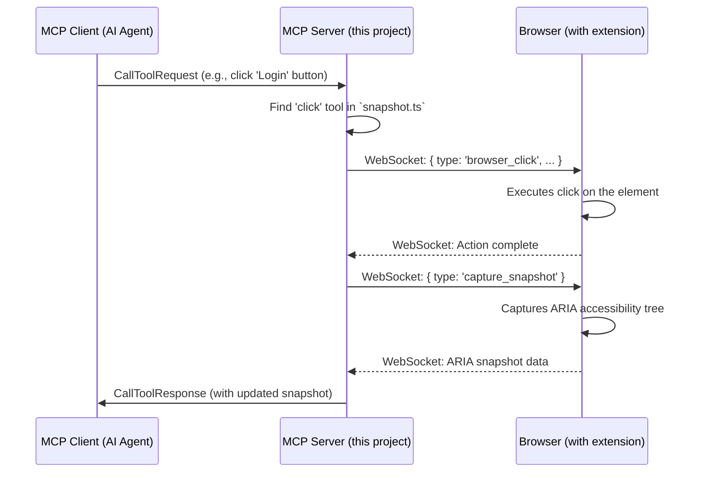

# Browser MCP Server Overview

This document provides a comprehensive overview of the `@browsermcp/mcp` project, a Model Context Protocol (MCP) server designed for AI-driven browser automation.

## What is Browser MCP?

Browser MCP enables AI applications to control and interact with web browsers through a standardized protocol. It bridges the gap between AI reasoning and browser automation, allowing AI agents to:

- Navigate websites and interact with web elements
- Fill forms, click buttons, and perform user actions
- Capture screenshots and extract information from web pages
- Use existing browser profiles with logged-in sessions
- Avoid common bot detection mechanisms

## Architecture Overview

The system consists of three main components:

```
AI Application (Claude, Cursor, etc.)
        ↕ (MCP Protocol via stdio)
MCP Server (this project)
        ↕ (WebSocket)
Browser Extension
        ↕ (Browser APIs)
Web Browser
```

## Project Structure

The project is a TypeScript-based Node.js application. The main source code is located in the `src` directory, and the project's dependencies and scripts are defined in `package.json`.

Key files and directories:

*   `src/index.ts`: The main entry point of the application.
*   `src/server.ts`: Contains the server implementation.
*   `src/ws.ts`: Handles WebSocket communication.
*   `src/tools/`: Contains the definitions for the tools exposed by the MCP server.
*   `package.json`: Defines project metadata, dependencies, and scripts.

## Core Technologies

*   **Node.js & TypeScript**: The runtime environment and language.
*   **@modelcontextprotocol/sdk**: The core SDK for building the MCP server.
*   **ws**: Used for WebSocket communication.
*   **commander**: For creating the command-line interface.
*   **zod**: For data validation.
*   **tsup**: For bundling the TypeScript code.

## Server Initialization and Tools

The server is initialized in `src/index.ts`. It uses the `commander` library to define the command-line interface. The main action of the program is to create and start the MCP server.

### Transport Layer

The MCP server uses **StdioServerTransport** for communication with AI applications. This is the standard MCP approach where:

- AI applications communicate with the MCP server via standard input/output (stdio)
- The MCP server maintains a separate WebSocket server for browser extension communication
- This dual-transport approach allows the server to act as a bridge between the MCP protocol and browser automation

```typescript
// MCP Server ↔ AI Application (via stdio)
const transport = new StdioServerTransport();
await server.connect(transport);

// MCP Server ↔ Browser Extension (via WebSocket)
const wss = await createWebSocketServer(); // Internal WebSocket server
```

The server is created using the `createServerWithTools` function from `src/server.ts`. It's configured with a set of tools that define its browser automation capabilities. These tools are imported from the `src/tools` directory and grouped into the following categories:

*   **Common Tools**: Basic browser actions like `pressKey` and `wait`.
*   **Custom Tools**: Additional functionalities like `getConsoleLogs` and `screenshot`.
*   **Snapshot Tools**: A comprehensive set of tools for interacting with a snapshot of the DOM, including `click`, `hover`, `type`, and `selectOption`.

The server communicates using `StdioServerTransport`, meaning it uses standard input/output to interact with a parent process.

## Server Architecture

The core server logic resides in `src/server.ts`. The `createServerWithTools` function is the factory for the MCP server. It performs the following key functions:

1.  **Initializes the MCP Server**: It creates an instance of the `Server` class from the `@modelcontextprotocol/sdk`.

2.  **Manages WebSocket Connections**: It sets up a WebSocket server to communicate with the browser. A `Context` object is used to manage the active WebSocket connection and other shared states, which is then passed to tool handlers.

3.  **Handles MCP Requests**: It registers handlers for standard MCP requests:
    *   `ListTools`: Returns the schemas of the available tools.
    *   `CallTool`: Finds the requested tool by name and executes its `handle` method, passing the `context` and arguments.
    *   `ListResources` and `ReadResource`: Manages the available data resources.

4.  **Graceful Shutdown**: It extends the server's `close` method to ensure that the WebSocket server and the context are properly terminated.

## Tool Architecture

The foundation for all tools is defined in `src/tools/tool.ts`. This file establishes a clear and consistent structure for how tools are defined and executed.

Key components of the tool architecture include:

*   **`Tool` Interface**: The central interface that every tool implements. It has two main properties:
    *   `schema`: An object (`ToolSchema`) that describes the tool's name, description, and the JSON schema for its input arguments. This metadata is used by the MCP server to expose the tool's capabilities to clients.
    *   `handle`: The function that contains the tool's core logic. It receives the application `Context` and the tool's arguments, performs its action (e.g., interacting with the browser), and returns a `Promise` that resolves with a `ToolResult`.

*   **`ToolFactory`**: A type for a function that creates a `Tool`. This factory pattern allows for creating different versions of a tool based on certain conditions, such as whether it operates on a DOM snapshot.

This architecture ensures that all tools are self-describing and adhere to a uniform contract, making them easy to manage and integrate into the server.

### Common Tools (`src/tools/common.ts`)

This file implements the most basic browser interaction tools. The core logic for each tool involves sending a specific message (e.g., `browser_navigate`, `browser_press_key`) over the WebSocket connection to the browser client.

*   **`navigate`**: Navigates the browser to a specified URL.
*   **`goBack`**: Navigates to the previous page in the browser's history.
*   **`goForward`**: Navigates to the next page in the browser's history.
*   **`wait`**: Pauses execution for a specified duration.
*   **`pressKey`**: Simulates pressing a key on the keyboard.

The navigation tools (`navigate`, `goBack`, `goForward`) are implemented as `ToolFactory` functions. This allows them to be created with a `snapshot` flag. If `true`, the tool will capture and return an ARIA snapshot of the page after the action, providing the client with an updated view of the page's content and structure.

### Custom Tools (`src/tools/custom.ts`)

This file provides tools for inspecting the state of the web page.

*   **`getConsoleLogs`**: Retrieves the browser's console logs, which is essential for debugging.
*   **`screenshot`**: Captures a screenshot of the current page, providing a visual record of the page's state.

### Snapshot Tools (`src/tools/snapshot.ts`)

These tools provide powerful capabilities for interacting with the Document Object Model (DOM) of a web page through an ARIA (Accessible Rich Internet Applications) snapshot. This snapshot provides a structured representation of the page's UI elements.

*   **`snapshot`**: Captures and returns a fresh ARIA snapshot of the page.

All other tools in this file build upon this snapshot functionality. They first perform an action and then return an updated snapshot, allowing the client to see the immediate result of its command.

*   **`click`**: Clicks on a specified element.
*   **`hover`**: Hovers the mouse over an element.
*   **`type`**: Types text into an element.
*   **`selectOption`**: Selects an option within a dropdown element.
*   **`drag`**: Drags an element from a start to an end position.

## Detailed Workflow

### 1. Initialization Phase

1. **MCP Server Startup**: The server starts and creates a WebSocket server (port 8080 by default)
2. **Browser Extension Connection**: The browser extension connects to the WebSocket server
3. **AI Application Connection**: The AI application connects to the MCP server via stdio transport
4. **Tool Registration**: The server exposes available tools (click, type, screenshot, etc.) to the AI application

### 2. Command Execution Phase

When an AI application wants to perform a browser action:

1. **AI Command**: AI sends an MCP `CallTool` request (e.g., "click the login button")
2. **Tool Resolution**: MCP server finds the corresponding tool handler
3. **WebSocket Message**: Server sends a structured message to the browser extension
4. **Browser Action**: Extension executes the action using browser APIs
5. **State Capture**: Extension captures the new page state (ARIA accessibility tree)
6. **Response Chain**: Updated state flows back through the same chain to the AI

### 3. State Management

- **Context Object**: Manages WebSocket connections and shared state
- **ARIA Snapshots**: Provides semantic representation of web pages
- **Error Handling**: Graceful handling of connection issues and browser errors

## Component Interaction Flow

The following diagram illustrates a typical `CallTool` request flow:



**Step-by-Step Breakdown:**

1.  **Client Request**: An MCP client (like an AI agent) sends a `CallTool` request to the server via standard I/O. The request specifies the tool name (`click`) and its arguments (e.g., the element to click).
2.  **Server Handling**: The server receives the request and finds the corresponding tool definition.
3.  **WebSocket Command**: The tool's `handle` method sends a JSON message over the active WebSocket connection to the browser extension, instructing it to perform the action (e.g., `browser_click`).
4.  **Browser Action**: The browser extension receives the message and uses browser APIs to execute the action, such as simulating a click on the specified element.
5.  **Snapshot Capture**: After the action, the server-side tool requests a new ARIA snapshot from the browser via another WebSocket message.
6.  **Response to Client**: The browser sends the captured snapshot back to the server. The server packages this snapshot into a `CallToolResponse` and sends it back to the client, completing the cycle.

---

## Design Notes

### Why does the snapshot tool use the ARIA tree instead of the full HTML?

The snapshot tool intentionally captures the ARIA (Accessible Rich Internet Applications) accessibility tree rather than the raw HTML DOM. This is a deliberate design choice for several key reasons:

1.  **Focus on Semantics**: The ARIA tree provides a semantic representation of the page, focusing on interactable elements (buttons, links, forms) and their purpose. This is much more useful for an AI agent than parsing a complex HTML structure filled with non-semantic layout elements.

2.  **Efficiency**: The ARIA tree is significantly more compact than the full DOM, leading to faster processing and smaller data transfers.

3.  **Robustness**: Automation based on accessibility roles is more resilient to minor changes in the HTML structure. As long as an element's role (e.g., `button`) and name (e.g., "Login") remain consistent, the agent can still find and interact with it, even if the underlying HTML tag or CSS classes change.

In essence, the tool is optimized for **programmatic control and interaction**, not for web scraping.
